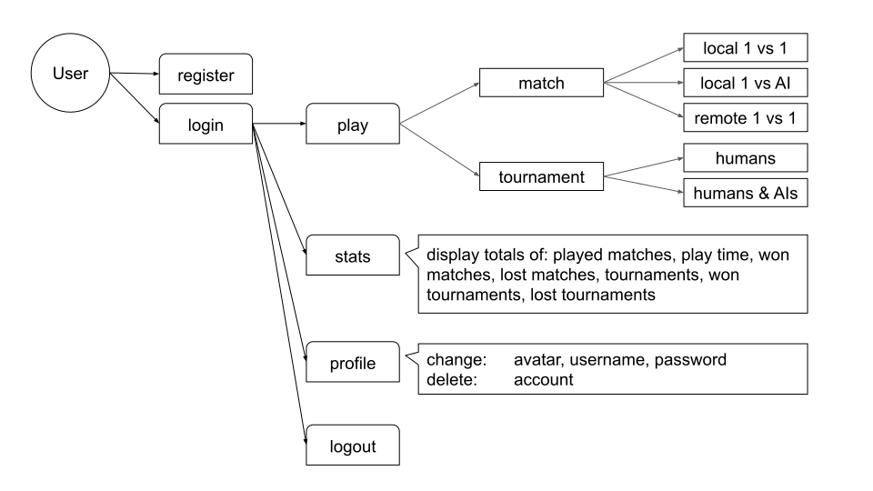

# Transcendence: Pong Game Web App (Work in Progress)

We aim to develop a full-stack 3D multiplayer Pong game with a microservices architecture.

Key features:

- Real-time remote multiplayer and tournaments
- AI opponents
- Game statistics
- Cross-device compatibility
- Single-page application

## Table of Contents

- [Installation and Usage](#installation-and-usage)
- [Userflow](#userflow)
- [Microservices Architecture](#microservices-architecture)
- [Database Model](#database-model)
- [Frontend overview](#frontend-overview)
- [Sources](#sources)

## Installation and Usage

tbd

## Userflow

<picture>
  <source media="(prefers-color-scheme: light)" srcset="diagrams/userflow.svg">
  <source media="(prefers-color-scheme: dark)" srcset="diagrams/userflow_dark.svg">
  
</picture>

## Microservices Architecture

<picture>
  <source media="(prefers-color-scheme: light)" srcset="diagrams/microservices.svg">
  <source media="(prefers-color-scheme: dark)" srcset="diagrams/microservices_dark.svg">
  
</picture>

## Database Model

<picture>
  <source media="(prefers-color-scheme: light)" srcset="diagrams/databases.svg">
  <source media="(prefers-color-scheme: dark)" srcset="diagrams/databases_dark.svg">
  
</picture>

## Frontend Overview

The frontend of the **Transcendence: Pong Game Web App** is a **single-page application (SPA)** built with the following stack and principles:

- **Vanilla JavaScript**: No frameworks, ensuring lightweight and optimized performance.
- **Rollup.js**: A powerful bundler used to efficiently build the application for production.
- **Bootstrap**: For responsive design and consistent UI components.
- **CSS Modules**: To scope styles locally, preventing global CSS conflicts.

### Key Features

- **Component-based design**: Reusable components are built with `createComponent` for structured and clean development.
- **Reactivity system**: Powered by `createSignal` and `createEffect` to manage state and side effects efficiently.
- **Event handling and cleanup**: Uses `createCleanupContext()` to ensure proper resource management and event unsubscriptions.
- **Modular styling**: CSS Modules ensure that styles are scoped per component, maintaining code clarity and avoiding style leakage.

### Documentation

- [How to Start](frontend/docs/HowToStart.md): Project installation, running instructions, and how to start working with the SPA.
- [Settings](frontend/docs/Settings.md): Configuration details and project settings.
- [Reactivity System](frontend/docs/ReactivitySystem.md): Details on `createSignal`, `createEffect`, and more.
- [Component System](frontend/docs/ComponentSystem.md): Usage of `createComponent` and helper methods.
- [Router](frontend/docs/Router.md): Setting up and managing routes in the application.
- [Project Structure](frontend/docs/ProjectStructure.md): Structure of the project and how to organize code.

## Sources

[Django Tutorial](https://docs.djangoproject.com/en/.1/intro/tutorial01/)

- Part 1 to 4: Definitely recommended
- Part 2 to 8: Revisit for automated testing, debugging, etc.

[Bootstrap Introduction](https://getbootstrap.com/docs/5.3/getting-started/introduction/)
