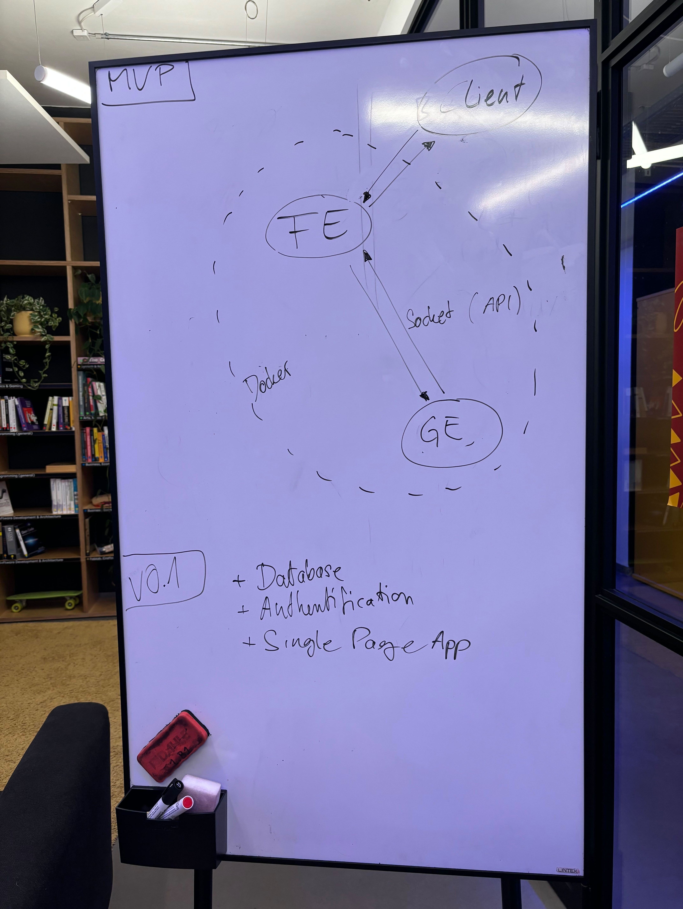

# Transcendence
## Table of Contents
- [Research](#research)
  - [Databases](#databases)
  - [Microservices](#microservices)
  - [User and Game Stats](#user-and-game-stats)
- [hackyMVP](#hackymvp)
- [MVP and V0.1](#mvp-and-v01)
- [Sources](#sources)
  - [Useful Resources](#useful-resources)
  - [Similar projects](#similar-projects)

## hackyMVP
No dockerization, only game engine with django and FE with bootstrap.

The initial implementation is functional but experiences some lag. To start the server, run `python manage.py runserver` and navigate to `localhost` in your browser. Use the `w` and `s` keys, or the `up` and `down` arrow keys, to control the game.

## MVP and V0.1

## Research

### Databases
[PostgreSQL](https://www.youtube.com/watch?v=n2Fluyr3lbc)

### Microservices
Good if we want to build a functional MVP first and iteratively add new features.

An MVP could consist of the three services
- front-end,
- pong server (game engine, GE), and
- dockerization.

### User and Game Stats
Not MVP relevant and can be integrated as a service later.

## Sources

### Useful Resources

[Django Tutorial](https://docs.djangoproject.com/en/5.1/intro/tutorial01/)
- Part 1 to 4: definitely recommended
- Part 2 to 8: revisit for automated testing, debugging, etc.

[Bootstrap Introduction](https://getbootstrap.com/docs/5.3/getting-started/introduction/)

### Similar projects

[Best looking, well documented, microservice architecture](https://github.com/tdameros/42-transcendence)

[Good AI opponent docu](https://github.com/Linuswidmer/42_transcendence)
